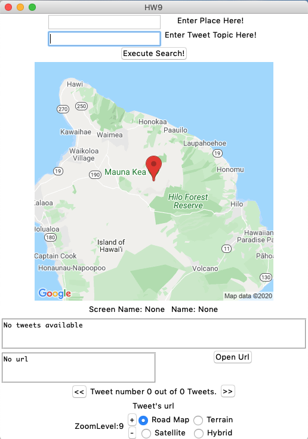

# GUIs
Exploration into creating GUIs using tkinter, a python GUI library

The Twitter:GoogleGUI is a GUI using python's library, tkinter, to create a Graphic User Interface that can search a user inputed topic and area to find and display related tweets on a
Goole static map. The user can then scroll through tweets and the GUI will display the profile name, contents of the tweet, change the google map pin to point to location of where the profile tweeted from, and also allow the user to open any url that is in the tweet. 
